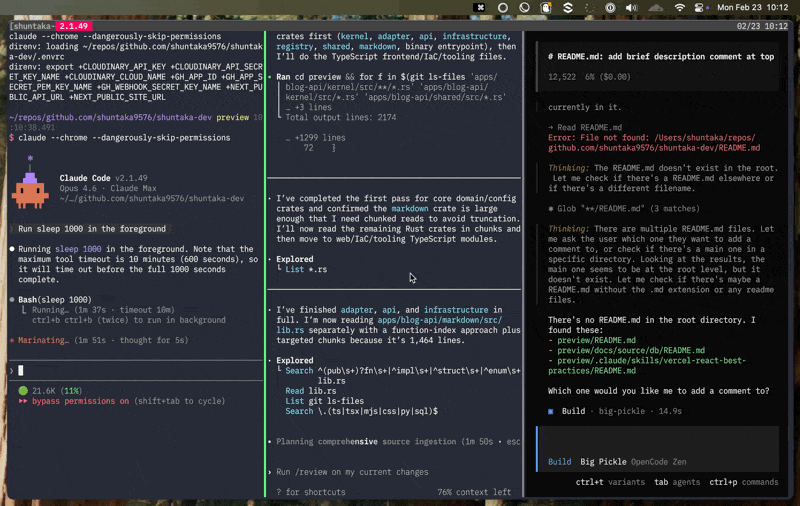

<div align="center">
  
  <h1>agentoast</h1>
  <p>
    
  </p>
</div>



A macOS menu bar app for tmux users. Get a toast notification whenever an AI coding agent (Claude Code, Codex, opencode) finishes or needs your input — click it to jump right back to the tmux pane it came from.

You kick off a long-running agent task, switch over to a browser or another window, and completely miss the moment it wraps up or asks for permission. agentoast makes sure you never miss it.

Add a [hook](#integration) to your agent's config. All notifications are grouped by repository in the menu bar — clicking one takes you straight to its tmux pane.


A toast pops up whenever an agent completes or needs attention — click it to jump right back to the tmux pane.


## Installation

```bash
brew install shuntaka9576/tap/agentoast-cli
brew install --cask shuntaka9576/tap/agentoast
```

Or download the DMG from [Releases](https://github.com/shuntaka9576/agentoast/releases).

To uninstall:

```bash
brew uninstall --cask shuntaka9576/tap/agentoast
brew uninstall shuntaka9576/tap/agentoast-cli
```

## Usage

### Notification

#### Integration

Ready-to-use integration scripts are provided for each agent. All agents use built-in CLI subcommands (`agentoast hook claude` / `agentoast hook codex` / `agentoast hook opencode`). opencode uses its [plugin system](https://opencode.ai/docs/plugins) to receive events, then delegates to the CLI subcommand. See [`examples/notify/`](examples/notify/) for source code.

##### Claude Code

`~/.claude/settings.json`

```json
{
  "hooks": {
    "Stop": [
      {
        "matcher": "",
        "hooks": [
          {
            "type": "command",
            "command": "agentoast hook claude"
          }
        ]
      }
    ],
    "Notification": [
      {
        "matcher": "",
        "hooks": [
          {
            "type": "command",
            "command": "agentoast hook claude"
          }
        ]
      }
    ]
  }
}
```

No Deno dependency required. The CLI reads hook data from stdin and writes directly to the notification database. See [`examples/notify/claude.ts`](examples/notify/claude.ts) for a Deno-based alternative.

##### Codex

`~/.codex/config.toml`

```toml
notify = [
  "agentoast hook codex",
]
```

No Deno dependency required. The CLI reads hook data from the last command-line argument and writes directly to the notification database. See [`examples/notify/codex.ts`](examples/notify/codex.ts) for a Deno-based alternative.

##### opencode

Drop the plugin file into `~/.config/opencode/plugins/` and it gets picked up automatically. The plugin forwards all events to `agentoast hook opencode`. Event filtering and notification mapping are configured in `config.toml` `[notification.agents.opencode]`.

```bash
mkdir -p ~/.config/opencode/plugins
cp examples/notify/opencode.ts ~/.config/opencode/plugins/
```

Supported events

| Event | Notification |
|---|---|
| `session.status` (idle) | Stop (green) |
| `session.error` | Error (red) |
| `permission.asked` | Permission (blue) |

#### Send Notification

```bash
agentoast send \
  --badge "Stop" \
  --body "Task Completed" \
  --badge-color green \
  --icon claude-code \
  --repo my-repo \
  --tmux-pane %0 \
  --meta branch=main
```

| Option | Short | Required | Default | Description |
|---|---|---|---|---|
| `--badge` | `-B` | No | `""` | Badge text displayed on notification card |
| `--body` | `-b` | No | `""` | Notification body text |
| `--badge-color` | `-c` | No | `gray` | Badge color (`green`, `blue`, `red`, `gray`) |
| `--icon` | `-i` | No | `agentoast` | Icon preset (`agentoast` / `claude-code` / `codex` / `opencode`) |
| `--repo` | `-r` | No | auto | Repository name for grouping notifications. Auto-detected from git remote or directory name if omitted |
| `--tmux-pane` | `-t` | No | `""` | tmux pane ID. Used for focus-on-click and batch dismiss (e.g. `%0`) |
| `--bundle-id` | — | No | auto | Terminal bundle ID for focus-on-click (e.g. `com.github.wez.wezterm`). Auto-detected from `__CFBundleIdentifier` env var if not specified |
| `--focus` | `-f` | No | `false` | Focus terminal automatically when notification is sent. A toast is shown with "Focused: no history" label, but the notification does not appear in the notification history |
| `--meta` | `-m` | No | - | Display metadata as key=value pairs (can be specified multiple times). Shown on notification cards |

Clicking a notification dismisses it and brings you back to the terminal. With `--tmux-pane`, all notifications sharing the same `--tmux-pane` are dismissed at once. Sending a new notification with the same `--tmux-pane` replaces the previous one, so only the latest notification per pane is kept.

When a terminal is focused and the notification's originating tmux pane is the active pane, notifications are automatically suppressed — since you're already looking at it.

For a quick test, you can fire off notifications straight from the CLI.

Claude Code

```bash
agentoast send \
  --badge "Stop" \
  --badge-color green \
  --icon claude-code \
  --repo your-repo \
  --tmux-pane %0 \
  --meta branch=your-branch
```

Codex (OpenAI)

```bash
agentoast send \
  --badge "Notification" \
  --badge-color blue \
  --icon codex \
  --repo your-repo \
  --meta branch=your-branch
```

opencode

```bash
agentoast send \
  --badge "Stop" \
  --badge-color green \
  --icon opencode \
  --repo your-repo \
  --tmux-pane %0 \
  --meta branch=your-branch
```

### Config

Opens `~/.config/agentoast/config.toml` in your editor, creating a default one if it doesn't exist yet.

```bash
agentoast config
```

Editor resolution priority is `config.toml` `editor` field → `$EDITOR` → `vim`

```toml
# agentoast configuration

# Editor to open when running `agentoast config`
# Falls back to $EDITOR environment variable, then vim
# editor = "vim"

# Toast popup notification
[toast]
# Display duration in milliseconds (default: 4000)
# duration_ms = 4000

# Keep toast visible until clicked (default: false)
# persistent = false

# Notification settings
[notification]
# Mute all notifications (default: false)
# muted = false

# Show only groups with notifications (default: false)
# filter_notified_only = false

# Claude Code agent settings
[notification.agents.claude_code]
# Events that trigger notifications
# Available: Stop, permission_prompt, idle_prompt, auth_success, elicitation_dialog
# idle_prompt is excluded by default (noisy); add it back if you want idle notifications
# events = ["Stop", "permission_prompt", "auth_success", "elicitation_dialog"]

# Events that auto-focus the terminal (default: none)
# These events set force_focus=true, causing silent terminal focus without toast (when not muted)
# focus_events = []

# Codex agent settings
[notification.agents.codex]
# Events that trigger notifications
# Available: agent-turn-complete
# events = ["agent-turn-complete"]

# Events that auto-focus the terminal (default: none)
# focus_events = []

# Include last-assistant-message as notification body (default: true, truncated to 200 chars)
# include_body = true

# OpenCode agent settings
[notification.agents.opencode]
# Events that trigger notifications
# Available: session.status (idle only), session.error, permission.asked
# events = ["session.status", "session.error", "permission.asked"]

# Events that auto-focus the terminal (default: none)
# focus_events = []

# Keyboard shortcuts
[keybinding]
# Shortcut to toggle the notification panel (default: super+ctrl+n)
# Format: modifier+key (modifiers: ctrl, shift, alt/option, super/cmd)
# Set to "" to disable
# toggle_panel = "super+ctrl+n"
```

### Keyboard Shortcuts

Panel shortcuts (press `?` in the panel to see this list).

| Key | Action |
|---|---|
| `j` / `k` | Next / Previous |
| `Enter` | Open / Fold |
| `d` | Delete notif |
| `D` | Delete all notifs |
| `C` / `E` | Collapse all / Expand all |
| `F` | Filter notified |
| `Tab` / `Shift+Tab` | Jump to next / prev notified pane |
| `Esc` | Close |
| `?` | Help |

The global shortcut to toggle the panel is `Cmd+Ctrl+N` (configurable in `config.toml`).

### Tips

Set up a shell alias for command completion notifications. With `--tmux-pane`, clicking the notification jumps back to the pane.

```bash
alias an='agentoast send --badge Done --badge-color green --tmux-pane "$TMUX_PANE"'
```

```bash
sleep 10; an -b "body"
```

