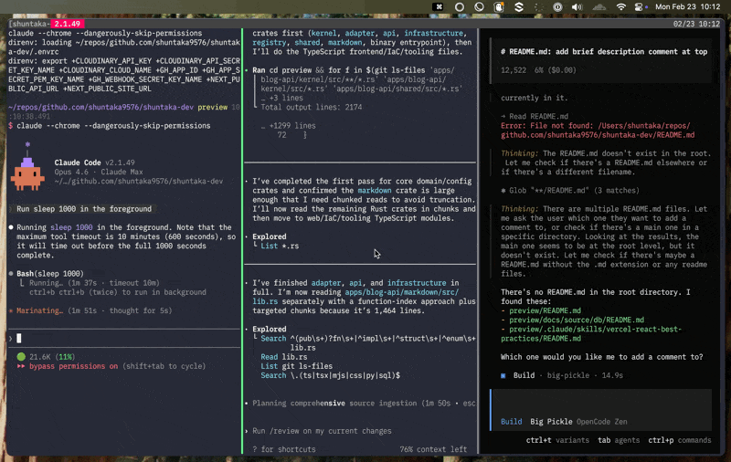
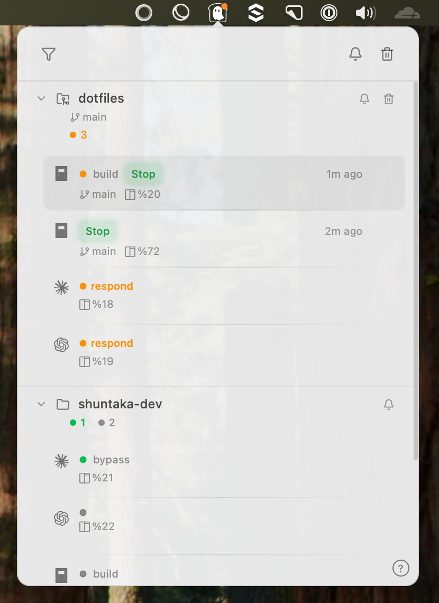
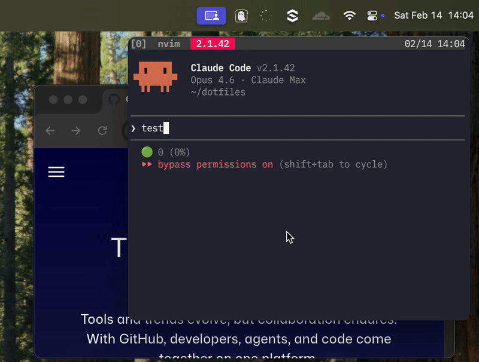
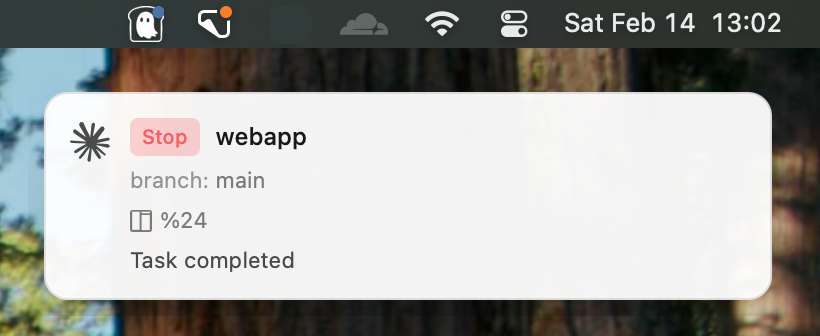

<div align="center">
  
  <h1>agentoast</h1>
  <p>
    
  </p>
</div>



A macOS menu bar app for tmux users. Get a toast notification whenever an AI coding agent (Claude Code, Codex, Copilot CLI, opencode) finishes or needs your input — click it to jump right back to the tmux pane it came from.

You kick off a long-running agent task, switch over to a browser or another window, and completely miss the moment it wraps up or asks for permission. agentoast makes sure you never miss it.

Add a [hook](#integration) to your agent's config. All notifications are grouped by repository in the menu bar — clicking one takes you straight to its tmux pane.



A toast pops up whenever an agent completes or needs attention — click it to jump right back to the tmux pane.





## Requirements

| Command | Purpose                               | Required |
| ------- | ------------------------------------- | -------- |
| `tmux`  | Session/pane management, agent status | Yes      |

Repository and branch info is read directly from `.git` metadata, and the process tree is read via native macOS APIs — neither the `git` binary nor `ps` is required.

agentoast auto-detects the tmux binary path by searching well-known locations (Homebrew, system, Nix). If the Sessions panel is empty, see the [`[system]` config](#system-binary-paths) to set the path manually.

## Installation

```bash
brew install --cask shuntaka9576/tap/agentoast
```

This installs the menu bar app and the `agentoast` CLI in one step.

Or download the DMG from [Releases](https://github.com/shuntaka9576/agentoast/releases).

To uninstall:

```bash
brew uninstall --cask shuntaka9576/tap/agentoast
```

## Usage

### Works With

| Agent                                                    | Hook Config                            | Events                              | Status Detection                       |
| -------------------------------------------------------- | -------------------------------------- | ----------------------------------- | -------------------------------------- |
| [Claude Code](https://github.com/anthropics/claude-code) | `~/.claude/settings.json`              | Stop, Permission, Auth, Elicitation | Running / Idle / Waiting / Agent Teams |
| [Codex](https://github.com/openai/codex)                 | `~/.codex/config.toml`                 | Turn Complete                       | Running / Idle / Waiting               |
| [Copilot CLI](https://github.com/github/copilot-cli)     | `.github/hooks/*.json`                 | Agent Stop, Error                   | Running / Idle / Waiting               |
| [opencode](https://github.com/anomalyco/opencode)        | Plugin (`~/.config/opencode/plugins/`) | Session Idle, Error, Permission     | Running / Idle / Waiting               |
| 🚧 [Kiro CLI](https://github.com/aws/kiro-cli)           | —                                      | —                                   | —                                      |

All agents utilize the built-in CLI (`agentoast hook <agent>`). See the [Integration](#integration) section for setup details. If you'd like to see support for other agents, please feel free to [open an issue](https://github.com/shuntaka9576/agentoast/issues).

### Config

Opens `~/.config/agentoast/config.toml` in your editor, creating a default one if it doesn't exist yet.

```bash
agentoast config
```

Editor resolution priority is `config.toml` `editor` field → `$EDITOR` → `vim`

For the most common options (toast duration, global shortcut, auto-update, editor), you can also right-click the menu bar icon and choose **Settings…** to open a GUI editor. Changes are written back to `config.toml`; most take effect after a restart, and a banner with a **Quit & Relaunch** button is shown when needed.

```toml
# agentoast configuration

# Editor to open when running `agentoast config`
# Falls back to $EDITOR environment variable, then vim
# editor = "vim"

# Toast popup notification
[toast]
# Display duration in milliseconds (default: 4000)
# duration_ms = 4000

# Keep toast visible until clicked (default: false)
# persistent = false

# Notification settings
[notification]
# Mute all notifications (default: false)
# muted = false

# Show only groups with notifications (default: false)
# filter_notified_only = false

# Show tmux panes without an AI coding agent (default: false)
# show_non_agent_panes = false

# Claude Code agent settings
[notification.agents.claude_code]
# Events that trigger notifications
# Available: Stop, permission_prompt, idle_prompt, auth_success, elicitation_dialog, TeammateIdle, TaskCompleted
# idle_prompt, TeammateIdle, TaskCompleted are excluded by default
# events = ["Stop", "permission_prompt", "auth_success", "elicitation_dialog"]

# Events that auto-focus the terminal (default: none)
# These events set force_focus=true, causing silent terminal focus without toast (when not muted)
# focus_events = []

# Include last-assistant-message as notification body (default: true, truncated to 200 chars)
# include_body = true

# Codex agent settings
[notification.agents.codex]
# Events that trigger notifications
# Available: agent-turn-complete
# events = ["agent-turn-complete"]

# Events that auto-focus the terminal (default: none)
# focus_events = []

# Include last-assistant-message as notification body (default: true, truncated to 200 chars)
# include_body = true

# OpenCode agent settings
[notification.agents.opencode]
# Events that trigger notifications
# Available: session.status (idle only), session.error, permission.asked
# events = ["session.status", "session.error", "permission.asked"]

# Events that auto-focus the terminal (default: none)
# focus_events = []

# Copilot CLI agent settings
[notification.agents.copilot_cli]
# Events that trigger notifications
# Available: agentStop, subagentStop, errorOccurred
# events = ["agentStop"]

# Events that auto-focus the terminal (default: none)
# focus_events = []

# Include error message as notification body (default: true, truncated to 200 chars)
# include_body = true

# Keyboard shortcuts
[keybinding]
# Shortcut to toggle the notification panel (default: super+ctrl+n)
# Format: modifier+key (modifiers: ctrl, shift, alt/option, super/cmd)
# Set to "" to disable
# toggle_panel = "super+ctrl+n"

# System settings
# Override the auto-detected tmux binary path (useful when auto-detection fails)
# [system]
# tmux = "/custom/path/to/tmux"
```

#### System Binary Paths

agentoast auto-detects `tmux` by searching in this order.

1. **Well-known paths** — Homebrew (Apple Silicon / Intel), system (`/usr/bin`)
2. **Nix paths** — Home Manager (`/etc/profiles/per-user/$USER/bin/`), single-user (`/nix/var/nix/profiles/default/bin/`)
3. **`$PATH` fallback** — scans `$PATH` entries (mise, asdf, etc.)

> **Note:** The `$PATH` fallback only works when the app is launched from a terminal. Finder / Dock / Spotlight launches do not inherit the shell `$PATH`.

If auto-detection fails (Sessions panel is empty), override the path in `config.toml`.

```toml
[system]
tmux = "/your/custom/path/to/tmux"
```

### Keyboard Shortcuts

Panel shortcuts (press `?` in the panel to see this list).

| Key                 | Action                            |
| ------------------- | --------------------------------- |
| `j` / `k`           | Next / Previous                   |
| `Enter`             | Open / Fold                       |
| `d`                 | Delete notif                      |
| `D`                 | Delete all notifs                 |
| `C` / `E`           | Collapse all / Expand all         |
| `F`                 | Filter notified                   |
| `Tab` / `Shift+Tab` | Jump to next / prev notified pane |
| `Esc`               | Close                             |
| `?`                 | Help                              |

The global shortcut to toggle the panel is `Cmd+Ctrl+N` (configurable in `config.toml`).

### Notification

#### Integration

Ready-to-use integration scripts are provided for each agent. All agents use built-in CLI subcommands (`agentoast hook claude` / `agentoast hook codex` / `agentoast hook opencode`). opencode uses its [plugin system](https://opencode.ai/docs/plugins) to receive events, then delegates to the CLI subcommand. See [`examples/notify/`](examples/notify/) for source code.

##### Claude Code

`~/.claude/settings.json`

```json
{
  "hooks": {
    "Stop": [
      {
        "matcher": "",
        "hooks": [
          {
            "type": "command",
            "command": "agentoast hook claude"
          }
        ]
      }
    ],
    "Notification": [
      {
        "matcher": "",
        "hooks": [
          {
            "type": "command",
            "command": "agentoast hook claude"
          }
        ]
      }
    ]
  }
}
```

No Deno dependency required. The CLI reads hook data from stdin and writes directly to the notification database. See [`examples/notify/claude.ts`](examples/notify/claude.ts) for a Deno-based alternative.

##### Codex

`~/.codex/config.toml`

```toml
notify = [
  "agentoast hook codex",
]
```

No Deno dependency required. The CLI reads hook data from the last command-line argument and writes directly to the notification database. See [`examples/notify/codex.ts`](examples/notify/codex.ts) for a Deno-based alternative.

##### opencode

Drop the plugin file into `~/.config/opencode/plugins/` and it gets picked up automatically. The plugin forwards all events to `agentoast hook opencode`. Event filtering and notification mapping are configured in `config.toml` `[notification.agents.opencode]`.

```bash
mkdir -p ~/.config/opencode/plugins
cp examples/notify/opencode.ts ~/.config/opencode/plugins/
```

> **Note**: Earlier versions of `examples/notify/opencode.ts` included development-time debug logging that wrote every opencode event to `/tmp/opencode-notify-debug.log`, growing without bound. If you installed the plugin before this was fixed, re-copy the plugin and remove the stale log:
>
> ```bash
> cp examples/notify/opencode.ts ~/.config/opencode/plugins/
> rm -f /tmp/opencode-notify-debug.log
> ```

Supported events

| Event                   | Notification      |
| ----------------------- | ----------------- |
| `session.status` (idle) | Stop (green)      |
| `session.error`         | Error (red)       |
| `permission.asked`      | Permission (blue) |

##### Copilot CLI

`~/.copilot/config.json` (global) or `.github/hooks/*.json` (per-repo):

```json
{
  "hooks": {
    "agentStop": [
      {
        "type": "command",
        "bash": "agentoast hook copilot --event agentStop",
        "timeoutSec": 10
      }
    ],
    "errorOccurred": [
      {
        "type": "command",
        "bash": "agentoast hook copilot --event errorOccurred",
        "timeoutSec": 10
      }
    ]
  }
}
```

Unlike other agents, Copilot CLI configures separate hook entries per event. The `--event` flag tells agentoast which event triggered the hook. The notification body is extracted from the session transcript (`events.jsonl`).

Supported events

| Event           | Notification |
| --------------- | ------------ |
| `agentStop`     | Stop (green) |
| `subagentStop`  | Stop (green) |
| `errorOccurred` | Error (red)  |

#### Send Notification

```bash
agentoast send \
  --badge "Stop" \
  --body "Task Completed" \
  --badge-color green \
  --icon claude-code \
  --repo my-repo \
  --tmux-pane %0 \
  --meta branch=main
```

| Option          | Short | Required | Default     | Description                                                                                                                                                                 |
| --------------- | ----- | -------- | ----------- | --------------------------------------------------------------------------------------------------------------------------------------------------------------------------- |
| `--badge`       | `-B`  | No       | `""`        | Badge text displayed on notification card                                                                                                                                   |
| `--body`        | `-b`  | No       | `""`        | Notification body text                                                                                                                                                      |
| `--badge-color` | `-c`  | No       | `gray`      | Badge color (`green`, `blue`, `red`, `gray`)                                                                                                                                |
| `--icon`        | `-i`  | No       | `agentoast` | Icon preset (`agentoast` / `claude-code` / `codex` / `copilot-cli` / `opencode`)                                                                                            |
| `--repo`        | `-r`  | No       | auto        | Repository name for grouping notifications. Auto-detected from git remote or directory name if omitted                                                                      |
| `--tmux-pane`   | `-t`  | No       | `""`        | tmux pane ID. Used for focus-on-click and batch dismiss (e.g. `%0`)                                                                                                         |
| `--bundle-id`   | —     | No       | auto        | Terminal bundle ID for focus-on-click (e.g. `com.github.wez.wezterm`). Auto-detected from `__CFBundleIdentifier` env var if not specified                                   |
| `--focus`       | `-f`  | No       | `false`     | Focus terminal automatically when notification is sent. A toast is shown with "Focused: no history" label, but the notification does not appear in the notification history |
| `--meta`        | `-m`  | No       | -           | Display metadata as key=value pairs (can be specified multiple times). Shown on notification cards                                                                          |

Clicking a notification dismisses it and brings you back to the terminal. With `--tmux-pane`, all notifications sharing the same `--tmux-pane` are dismissed at once. Sending a new notification with the same `--tmux-pane` replaces the previous one, so only the latest notification per pane is kept.

When a terminal is focused and the notification's originating tmux pane is the active pane, notifications are automatically suppressed — since you're already looking at it.

For a quick test, you can fire off notifications straight from the CLI.

Claude Code

```bash
agentoast send \
  --badge "Stop" \
  --badge-color green \
  --icon claude-code \
  --repo your-repo \
  --tmux-pane %0 \
  --meta branch=your-branch
```

Codex (OpenAI)

```bash
agentoast send \
  --badge "Notification" \
  --badge-color blue \
  --icon codex \
  --repo your-repo \
  --meta branch=your-branch
```

opencode

```bash
agentoast send \
  --badge "Stop" \
  --badge-color green \
  --icon opencode \
  --repo your-repo \
  --tmux-pane %0 \
  --meta branch=your-branch
```

### Cross-Agent Messaging (Experimental)

> **Experimental**: This feature and its skill packaging are still evolving and may change or be removed without notice.

`agentoast send-keys` injects a message straight into another agent's prompt running in a different tmux pane, addressed only by its pane id (e.g. `%72`) — no team, login, or registration. Your own pane (`$TMUX_PANE`) is appended as a reply address, so the receiving agent can answer back into your pane.

```bash
agentoast send-keys --pane %72 "Please review the diff on this branch"
```

| Option       | Short | Default      | Description                                           |
| ------------ | ----- | ------------ | ----------------------------------------------------- |
| `--pane`     | `-t`  | (required)   | Target tmux pane id (e.g. `%72`)                      |
| `--from`     | —     | `$TMUX_PANE` | Sender pane id embedded as the reply address          |
| `--raw`      | —     | `false`      | Inject the raw message only, without the reply hint   |
| `--no-enter` | —     | `false`      | Type the text without submitting (no trailing Enter)  |
| `--force`    | —     | `false`      | Send even when the target pane runs no detected agent |

By default `send-keys` refuses a target pane that has no detected AI agent (a plain shell), since the message would just be typed into the shell prompt — usually a sign you picked the wrong pane. Pass `--force` when you are sure an agent is running there but the detector doesn't recognize it.

To let an agent drive this on its own (delegate a task, hand off, or reply to incoming messages), install the bundled [`agentoast-send`](skills/agentoast-send/SKILL.md) skill with [apm](https://github.com/danielmeppiel/apm).

```bash
apm install shuntaka9576/agentoast -t claude
```

This deploys the skill to `.claude/skills/`. Once installed, asking your agent to "ask the agent in pane %72 to review this" routes through `send-keys` automatically.

### Tips

Set up a shell alias for command completion notifications. With `--tmux-pane`, clicking the notification jumps back to the pane.

```bash
alias an='agentoast send --badge Done --badge-color green --tmux-pane "$TMUX_PANE"'
```

```bash
sleep 10; an -b "body"
```
